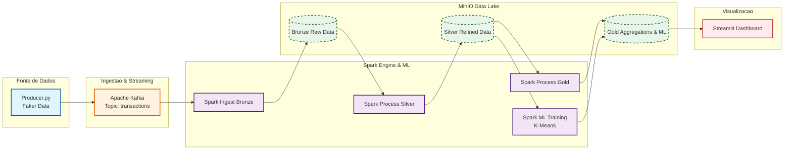

# 🛡️ Data Shield Enterprise | End-to-End Data Lakehouse

## 🚀 Projeto de Engenharia de Dados com foco em Detecção de Fraudes em Tempo Real

O **Data Shield Enterprise** simula uma arquitetura **realista de Big Data usada em fintechs, bancos e empresas de meios de pagamento** para **detecção de fraudes financeiras em tempo quase real**.

O objetivo não é só mover dados, mas **transformar eventos brutos em inteligência acionável**, aplicando boas práticas modernas de **Engenharia de Dados, Lakehouse e Machine Learning**.

> 💡 Pense nisso como um *mini ecossistema de dados corporativo*, rodando 100% em Docker, do evento ao dashboard.

---

## 🧠 Problema de Negócio Simulado

Empresas que processam pagamentos precisam:

* Detectar **transações suspeitas rapidamente**
* Escalar ingestão de eventos (milhares por segundo)
* Garantir **consistência, rastreabilidade e histórico** dos dados
* Disponibilizar **KPIs e alertas em tempo real** para áreas de risco

Este projeto resolve exatamente isso, simulando um fluxo completo de **anti-fraude orientado a dados**.

---

## 🏗️ Arquitetura da Solução

Arquitetura **Lakehouse com Medallion Architecture**, totalmente containerizada:

### 🔹 Ingestão (Streaming)

* **Producer:** Script Python (`producer.py`) gerando transações financeiras sintéticas com **Faker**
* **Mensageria:** **Apache Kafka** para ingestão distribuída e alta vazão
* **Consumo:** **Apache Spark Structured Streaming**

### 🔹 Armazenamento (Data Lake)

* **MinIO** como Object Storage compatível com **Amazon S3**
* **Delta Lake** como formato de armazenamento

  * ACID Transactions
  * Time Travel
  * Schema Enforcement

### 🔹 Processamento de Dados (ETL)

**Medallion Architecture aplicada na prática:**

* 🟤 **Bronze Layer**
  Dados brutos consumidos diretamente do Kafka (eventos como chegam)

* ⚪ **Silver Layer**
  Limpeza, deduplicação, normalização de schema e enriquecimento

* 🟡 **Gold Layer**
  Dados agregados prontos para consumo analítico e indicadores de negócio

### 🔹 Machine Learning (Detecção de Fraudes)

* Modelo **K-Means (Spark MLlib)**
* Clusterização de transações com base em:

  * Valor
  * Frequência
  * Padrões comportamentais
* **Outliers identificados como potenciais fraudes**

> ⚠️ O foco não é o modelo em si, mas **como ML se integra ao pipeline de dados em produção**.

### 🔹 Visualização e Monitoramento

* **Streamlit** para dashboard interativo
* Leitura direta dos dados processados no MinIO (S3)
* KPIs em tempo quase real:

  * Volume de transações
  * Distribuição de valores
  * Alertas de possíveis fraudes

---

## 🧩 Arquitetura Visual (Mermaid)



---

## 🛠️ Stack Tecnológica

* **Linguagem:** Python 3.8+
* **Processamento:** Apache Spark 3.5 (PySpark)
* **Streaming:** Apache Kafka & Zookeeper
* **Storage:** MinIO (S3 Compatible)
* **Formato:** Delta Lake
* **Machine Learning:** Spark MLlib
* **Infraestrutura:** Docker & Docker Compose
* **Visualização:** Streamlit & Plotly

---

## 🚀 Como Executar o Projeto

### Pré-requisitos

* Docker
* Docker Compose

### 1️⃣ Clone o repositório

```bash
git clone https://github.com/ricardo-ribeiro12/data-shield-lakehouse.git
cd data-shield-lakehouse
```

### 2️⃣ Suba toda a infraestrutura

```bash
docker-compose up -d
```

### 3️⃣ Inicie o gerador de eventos

```bash
docker exec -it spark-master python3 /app/producer.py
```

### 4️⃣ Execute os pipelines de dados

Os scripts devem ser submetidos via `spark-submit`:

* `ingest_bronze.py` → Ingestão Streaming
* `process_silver.py` → Limpeza e padronização
* `process_gold.py` → Agregações e KPIs
* `train_model.py` → Treinamento do modelo de fraude

### 5️⃣ Visualize o Dashboard

```bash
streamlit run dashboard.py
```

---

## 📌 Diferenciais do Projeto

✅ Arquitetura **end-to-end**, não só scripts isolados
✅ Uso real de **Streaming + Lakehouse**
✅ ML integrado ao pipeline (não notebook jogado)
✅ Infraestrutura reproduzível via Docker
✅ Padrão próximo ao encontrado em empresas de grande porte

---

## 👨‍💻 Sobre o Autor

**Ricardo Ribeiro**
Engenheiro de Dados | Analytics | Big Data

* GitHub: [https://github.com/ricardo-ribeiro12](https://github.com/ricardo-ribeiro12)
* LinkedIn: [https://www.linkedin.com/in/ricardo-ribeiro12](https://www.linkedin.com/in/ricardo-ribeiro12)

---

> 💬 *Este projeto foi desenvolvido com foco em demonstrar capacidade técnica prática para vagas de Engenharia de Dados, Analytics Engineer e áreas correlatas.*
